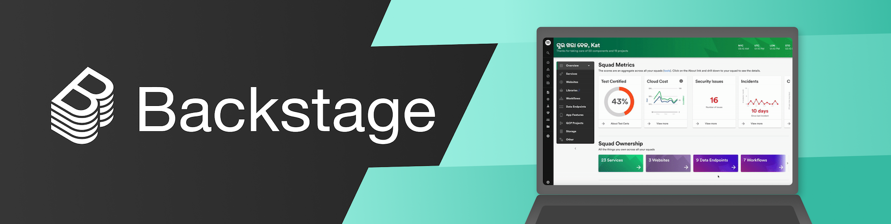
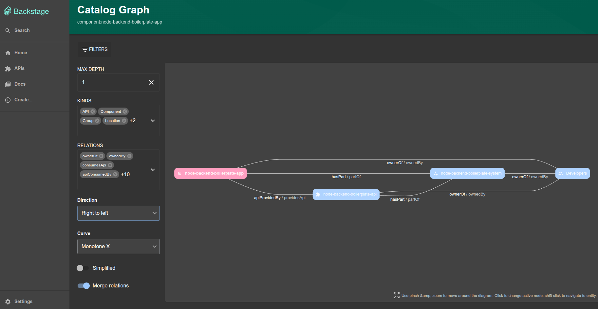
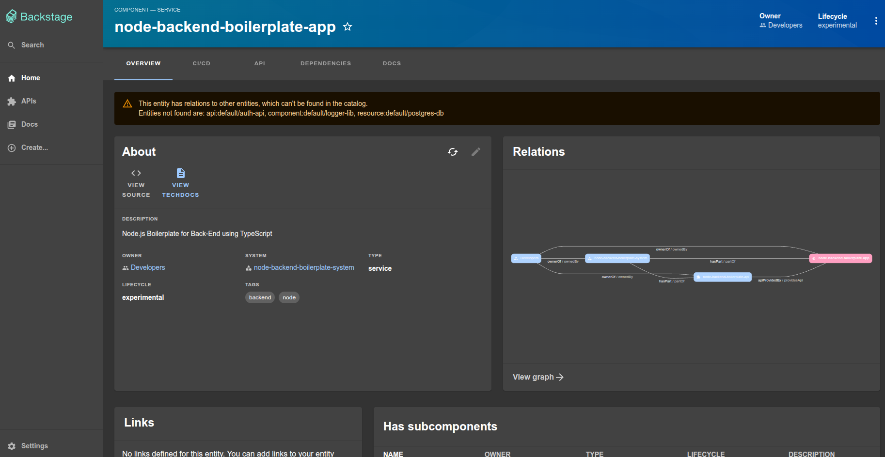
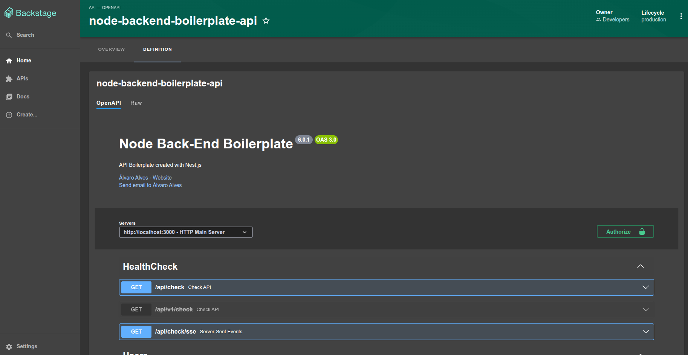
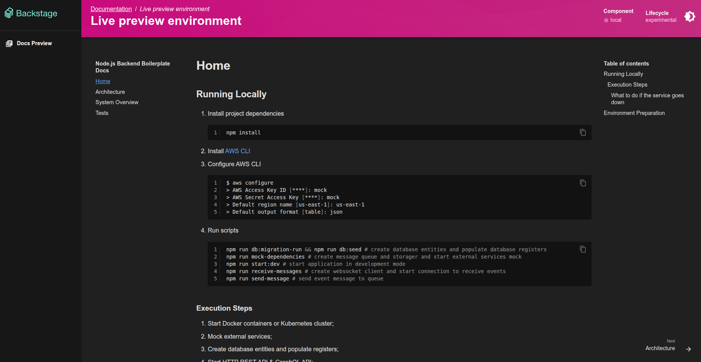

# [Backstage](https://backstage.io)

[](https://backstage.io/)

Project based on [Backstage, by Spotify](https://github.com/backstage/backstage) opensource project.  
Used for public projects by [AD Tech Solutions](https://www.linkedin.com/company/ad-techsolutions/).

## How to run this project

To start the app, run:
```sh
yarn install # for node 20 and 22
yarn start
```

## What is Backstage?

[Backstage](https://backstage.io/) is an open source framework for building developer portals. Powered by a centralized software catalog, Backstage restores order to your microservices and infrastructure and enables your product teams to ship high-quality code quickly without compromising autonomy.

Backstage unifies all your infrastructure tooling, services, and documentation to create a streamlined development environment from end to end.


Out of the box, Backstage includes:

- [Backstage Software Catalog](https://backstage.io/docs/features/software-catalog/) for managing all your software such as microservices, clusters, libraries, data pipelines, websites, and ML models;







- [Backstage Software Templates](https://backstage.io/docs/features/software-templates/) for quickly spinning up new projects and standardizing your tooling with your organization’s best practices;

- [Backstage TechDocs](https://backstage.io/docs/features/techdocs/) for making it easy to create, maintain, find, and use technical documentation, using a "docs like code" approach;



- Plus, a growing ecosystem of [open source plugins](https://github.com/backstage/backstage/tree/master/plugins) that further expand Backstage’s customizability and functionality.

Backstage was created by Spotify but is now hosted by the [Cloud Native Computing Foundation (CNCF)](https://www.cncf.io) as an Incubation level project. For more information, see the [announcement](https://backstage.io/blog/2022/03/16/backstage-turns-two#out-of-the-sandbox-and-into-incubation).
